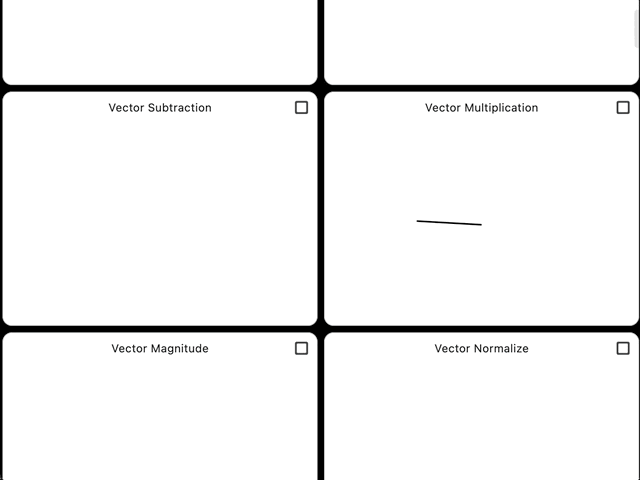

# floss

## Overview
Floss is a vector graphics abstraction library designed for Flutter
applications. It facilitates data-driven processing of input events and employs
a tree data structure for rendering graphics. The library draws inspiration from
the Haskell-based [gloss](https://github.com/benl23x5/gloss) library.



## Features
1. `FlossWidget`:
- The primary entry point for using the floss library is the `FlossWidget`. This
  widget integrates seamlessly into the Flutter widget tree and is typically
  instantiated within the build method of a Flutter Widget.
- The `FlossWidget` requires a `FocusNode` and a `Config` object. The
  `FocusNode` is used to capture keyboard events, while the `Config` object
  contains the configuration for the application, including the model
  constructor and the `Iud` interface.

2. `Iud` Interface:
- The `Iud` interface is a minimalistic interface that provides methods for
  initializing, updating, and drawing the model. It acts as the bridge between
  the application state and the rendering logic.
- The init method initializes the model, the update method updates the model
  based on input events and elapsed time, and the draw method generates the
  Drawing tree data structure.

3. `Drawing` Tree:
- The `Drawing` tree is a tree data structure composed of `Drawing` nodes. Each
  node represents a graphical element, such as shapes or composite operations
  like translations, rotations, and scaling.
- This tree structure allows for efficient and flexible rendering of complex
  graphics by breaking them down into manageable components.

## Getting started
1. Define the `Model` and `Iud`:
- Create a model class that represents the state of your application.
- Implement the Iud interface for your model. This involves defining the init,
  update, and draw methods.

2. Configure the `FlossWidget`:
- Instantiate a `FlossWidget` in your widget's build method.
- Pass a FocusNode and a Config object to the `FlossWidget`. The `Config object`
  should specify the model constructor and the `Iud` implementation and the
  `ClearCanvasType`.

3. Handle Input Events:
- The `FlossWidget` listens for various input events, such as long presses and
  gestures, and adds them to an `InputEventList`.
- These events are processed by the `Iud` implementation to update the model
  accordingly.

4. Render the `Drawing` Tree:
- The `FlossWidget` uses a custom painter (`_FlossPainter`) to render the
  `Drawing` tree on a canvas.
- The painter updates the model based on the elapsed time and input events, and
  then draws the updated `Drawing` tree.

### Example

```dart
import 'package:flutter/widgets.dart';
import 'package:floss/floss.dart';

class MyModel {
  // Define your model properties here
}

class MyIud implements Iud<MyModel> {
  @override
  MyModel init({
    required ModelCtor<MyModel> modelCtor,
    required Size size,
  }) {
    // Initialize the model
    return modelCtor();
  }

  @override
  MyModel update({
    required MyModel model,
    required Duration time,
    required InputEventList inputEvents,
  }) {
    // Update the model based on input events and elapsed time
    return model;
  }

  @override
  Drawing draw({required MyModel model, required Size size}) {
    // Generate the Drawing tree based on the model
    return Drawing(canvas_ops: [
        // Add CanvasOp or Drawing nodes here
    ]);
  }
}

class MyApp extends StatelessWidget {
  @override
  Widget build(BuildContext context) {
    return FlossWidget(
      focusNode: FocusNode(),
      config: Config(
        modelCtor: () => MyModel(),
        iud: MyIud(),
        clearCanvas: const f.ClearCanvas(),
      ),
    );
  }
}

void main() {
  runApp(MyApp());
}

```

## Usage

The `example/gallery` directory contains a sample Flutter application that
demonstrates the usage of the Floss library. The application displays a gallery
of interactive graphics that can be manipulated using various pointer events.
The gallery includes examples of basic shapes, transformations, and animations.
